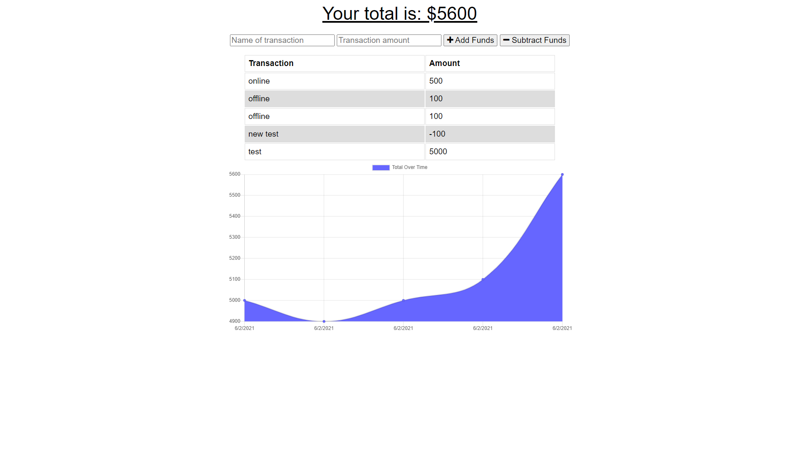

# budget-tracker

 ## Description 
    * This is a Progressive web app using MongoDB and IndexedDB for online/offline functionality.
  
  
  
  ## License 
  * MIT, to view License information click the badge below!
  * 

  
  ## Technologies 
  
    * JavaScript
    * NodeJs
    * Mongoose
    * IndexedDB
    * MongoDB

  ## Deployment 

[Heroku](https://protected-hamlet-72140.herokuapp.com/)

  
 
  
  ## Usage
    To install on your local device open the command line and run npm i, from there you can use 'npm run start' to run the application on your localhost.
  
  
  ## Contributions 
    Make pull requests to make changes.
  
  
  ## Support
  
  If you have any questions contact Michael, at moconnor0813@gmail.com or on github at https://github.com/oconnor97
  
  
  

